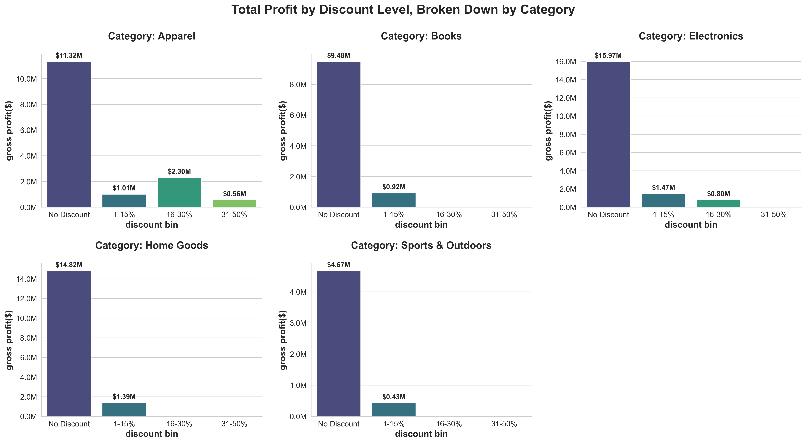

# Digital Emporium Pricing Strategy: Maximizing Profitability Through Data-Driven Pricing

This repository contains a comprehensive, end-to-end data analysis project that addresses a critical business problem: declining profitability despite stable revenue. It demonstrates a five-step analytical framework to diagnose profit leaks, understand customer behavior, and build a quantitative, data-driven pricing strategy that is projected to increase annual gross profit by **$6.14 million**.

## Table of Contents
- [1. Project Overview](#1-project-overview)
  - [Business Need](#business-need)
  - [Project Objective](#project-objective)
  - [Tech Stack](#tech-stack)
  - [Data Source](#data-source)
- [2. Project Structure](#2-project-structure)
- [3. The Analytical Framework (5-Step Methodology)](#3-the-analytical-framework-5-step-methodology)
- [4. Key Findings & Visualizations](#4-key-findings--visualizations)
  - [Analysis 1: Profit Margin Decomposition](#analysis-1-profit-margin-decomposition)
  - [Analysis 2: Promotional Effectiveness](#analysis-2-promotional-effectiveness)
  - [Analysis 3: Price Elasticity Analysis](#analysis-3-price-elasticity-analysis)
  - [Analysis 4: The Strategic Synthesis](#analysis-4-the-strategic-synthesis)
  - [Analysis 5: Financial Impact & Business Case](#analysis-5-financial-impact--business-case)
- [5. Final Business Recommendations](#5-final-business-recommendations)
- [6. How to Run This Project](#6-how-to-run-this-project)
  - [Prerequisites](#prerequisites)
  - [Setup Instructions](#setup-instructions)

---

## 1. Project Overview

### Business Need
The e-commerce company "Digital Emporium" is facing a critical business challenge: despite stable revenue, gross profit margins have been steadily declining for three consecutive quarters. The leadership team suspects the company's aggressive and uncoordinated discount strategy is cannibalizing profits. Decisions are being made on gut feeling—matching competitor discounts or running sitewide sales—without a clear understanding of the financial consequences. The company is effectively "leaking" profit but lacks the analytical framework to identify where the leaks are and how to plug them.

### Project Objective
The primary objective is to develop and present a comprehensive pricing strategy, backed by rigorous Python-based analysis, that provides "Digital Emporium" with a clear roadmap to reverse margin decline and drive sustainable profitability. This is achieved by diagnosing the problem, quantifying the impact of discounts, establishing pricing power, developing a strategic playbook, and building a robust financial model to project the profit uplift.

### Tech Stack
*   **Data Generation & Manipulation:** Python (`pandas`, `numpy`)
*   **Data Analysis:** Python (`pandas`, `scipy`)
*   **Data Visualization:** Python (`matplotlib`, `seaborn`)
*   **Reporting:** Jupyter Notebook

### Data Source
This project utilizes a synthetically generated dataset created with Python. This approach was chosen intentionally to ensure the presence of all necessary data points for a robust profitability and pricing analysis (like `product_cost` and `competitor_price`), which are often missing from public datasets. The generation script (`data/data_generation.py`) simulates a realistic e-commerce environment with varied margins, non-uniform discounts, and logical sales correlations.

---

## 2. Project Structure
The repository is organized for clarity and ease of use.
```
.
├── data/
│   └── data_generation.py         # Python script to generate the synthetic transactions_data.csv
├── csv                            # Contains all final CSV data tables generated by the analysis
├── visualization                  # Contains all final visualization PNG files
├── .gitignore                     # Specifies files to be ignored by Git
├── README.md                      # This project summary and guide
└── digital_emporium_pricing_strategy_analysis.ipynb # The final, complete Jupyter Notebook report
```

---

## 3. The Analytical Framework (5-Step Methodology)

This project follows a comprehensive 5-step analysis, with each step building on the last to form a cohesive strategic narrative.

1.  **Profit Margin Decomposition:** Deconstructed profitability down to the category and individual product level to pinpoint the exact sources of profit erosion.
    *   *Tool:* `Python (pandas)` for grouping and aggregation.

2.  **Promotional Effectiveness & Discount Optimization:** Modeled the "profit cliff" to identify the precise discount levels that were value-additive versus value-destructive.
    *   *Tool:* `Python (pandas)` for binning and aggregation; `seaborn` for visualization.

3.  **Price Elasticity Analysis:** Estimated customer price sensitivity for all product categories using historical sales data to inform our "pricing power."
    *   *Tool:* `Python (pandas)` for time-series resampling; `scipy` for linear regression; `seaborn` for visualization.

4.  **Competitive Price Benchmarking & Strategic Synthesis:** Placed internal pricing within the external market context to create a dynamic, rule-based 2x2 "Strategy Matrix."
    *   *Tool:* `Python (pandas)` for feature engineering; `matplotlib/seaborn` for visualization.

5.  **Financial Impact Modeling & Sensitivity Analysis:** Translated the strategic insights into a forward-looking financial forecast that quantifies the projected profit uplift of the proposed strategy, incorporating elasticity to ensure realistic projections.
    *   *Tool:* `Python (pandas)` for simulation and financial modeling.

---

## 4. Key Findings & Visualizations

### Analysis 1: Profit Margin Decomposition
The analysis revealed that profit erosion was not a company-wide problem but was concentrated in specific areas. The `Apparel` category was identified as the primary "Problem Child," and a "Profit Villains" list of specific, low-priced products was generated.


### Analysis 2: Promotional Effectiveness
We proved that deep discounts were the root cause of the problem. The "Profit Cliff" effect was being driven almost exclusively by the `Apparel` category, which was dangerously reliant on value-destructive promotions of 16-50% off.


### Analysis 3: Price Elasticity Analysis
In a crucial and counter-intuitive finding, the analysis showed that `Apparel` customers are relatively **inelastic** (not price-sensitive). This proved that the deep discounts were a strategic error, not a market necessity. We have the pricing power to reduce these discounts.


### Analysis 4: The Strategic Synthesis
All findings were combined into the "Pricing Strategy Matrix," a simple and powerful playbook. It placed `Apparel` in the "Assertive Pricing" quadrant (inelastic & underpriced), highlighting a massive opportunity to raise prices and cut discounts.


### Analysis 5: Financial Impact & Business Case
A sophisticated simulation, which accounted for customer elasticity, determined that the optimal discount cap for `Apparel` is **5%**. Implementing this and other targeted price increases is projected to have a massive positive impact on the bottom line.


---

## 5. Final Business Recommendations

Based on the comprehensive analysis, a three-pronged strategy is recommended, projected to increase annual gross profit by **$6.14 million**:

1.  **(Immediate Priority) Implement a "Smart Discount" Policy for Apparel:** Institute a hard cap of **5%** on all discounts in the `Apparel` category. Our simulation shows this single action is projected to increase gross profit by **$1.96 million** annually.

2.  **(Strategic Action) Execute Targeted Price Increases:** Initiate a **7%** price increase for `Apparel` and a more modest **3%** increase for `Books` and `Home Goods`. Our analysis proves these categories are inelastic and can sustain such increases with minimal risk to sales volume.

3.  **(Defensive Strategy) Protect Our "Value Leader" Position:** For our price-sensitive categories (`Electronics` & `Sports & Outdoors`), we must maintain our current competitive pricing. The recommendation is to actively monitor competitor prices and avoid price increases to protect our market share.

---

## 6. How to Run This Project

### Prerequisites
*   Python 3.8+
*   Jupyter Notebook or JupyterLab
*   The following Python libraries: `pandas`, `numpy`, `matplotlib`, `seaborn`, `scipy`

### Setup Instructions
1.  **Clone the Repository:**
    ```bash
    git clone https://github.com/your-username/your-repo-name.git
    cd your-repo-name
    ```
2.  **Generate the Data:**
    *   Navigate to the `data` directory and run the data generation script. This will create the `transactions_data.csv` file needed for the analysis.
    ```bash
    cd data
    python data_generation.py
    cd ..
    ```
    *   **Note:** The script will create the `transactions_data.csv` file in the root directory of the project. The notebook expects it to be there.

3.  **Run the Analysis:**
    *   Launch Jupyter Notebook from the project's root directory:
    ```bash
    jupyter notebook
    ```
    *   Open and run the cells in `digital_emporium_pricing_strategy_analysis.ipynb`. The notebook is self-contained and will generate all outputs (CSVs and visualizations) in the `output/` folder.
